# 💜 Scentify : 스마트 디퓨저 프로젝트 💜

## 📌 프로젝트 소개

### Scentify는 AI 기반 자동화 및 예약 모드를 제공하는 사용자 맞춤형 스마트 디퓨저입니다.

 

1. **주변 환경 또는 사용자 행동 기반 자동화 모드를 제공합니다.**

   - 탈취모드는 악취 감지 센서를 통해 악취 감지 시 분사하는 모드입니다.
   - 동작모드는 카메라 센서를 통해 인식된 사용자 행동을 분석하여 운동, 휴식 각각 도움이 되는 향을 분사하는 모드입니다.
   - 탐지모드는 카메라 센서에 사용자 감지 시 일정 간격으로 분사하는 모드입니다.

2. **예약 시간을 설정할 수 있는 스케줄 모드를 제공합니다.**

   - 사용자가 시간, 요일, 분사 주기, 향 조합을 설정하면 해당 시간에 분사합니다.

3. **찜한 향기 조합 페이지 저장 및 공유 기능을 제공합니다.**

   - 찜한 향기 조합에 대한 AI이미지 카드를 저장 가능합니다.
   - 또한 향기 조합을 링크로 공유 및 링크를 받은 사용자가 향기 조합을 등록할 수 있습니다.

- [Scentify 이용 매뉴얼](./exec/Scentify%20이용%20매뉴얼.pdf)
   
   

### 1️⃣ 프로젝트 기간

2025.01.08 ~ 2025.02.27

### 2️⃣ 팀원 소개

| 이름   | 역할  | 구현 기능                                                   |
| ------ | ----- | ----------------------------------------------------------- |
| 안태현 | EM    | 하드웨어 설계, AI 모델 학습, MQTT 통신                      |
| 어선정 | BE    | ERD 설계, API 명세서 작성, BE 개발, DB 관리, WebSocket 통신 |
|        | Infra | 배포 환경 구축                                              |
| 이가영 | FE    | Flowchart 작성, UI 디자인, Home 탭                          |
|        | Infra | FE 배포 환경 구축                                           |
| 이가희 | FE    | Wireframe 작성, My 탭, Scent 탭 공유하기 기능               |
| 주현호 | FE    | Wireframe 작성, Control 탭, Scent 탭 찜하기 기능            |
|        | EM    | WebSocket 초기 설정                                         |

### 3️⃣ 기술 스택

| 분야  | 기술 스택                                    |
| ----- | -------------------------------------------- |
| FE    | React 18.2.0, TypeScript, HTML, Tailwind CSS |
| BE    | Java 17, Spring Boot 3.4.1                   |
| DB    | MySQL 8.0.4, Redis                           |
| EM    | Python 3.8, Torch 2.1.0, Yolo v8, SlowFast   |
| Infra | AWS EC2, Jenkins, NginX, S3                  |

 

## 📌 기획서 및 요구사항 분석

### 1️⃣ 기획서

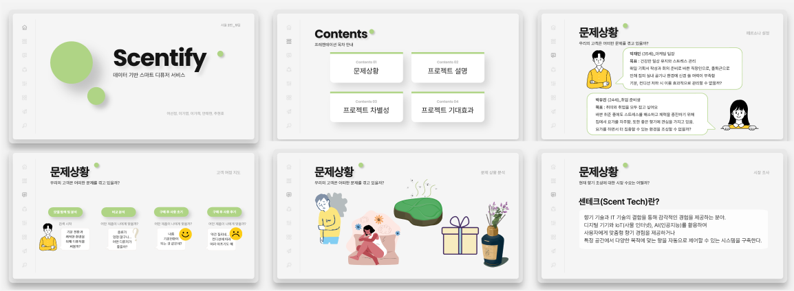
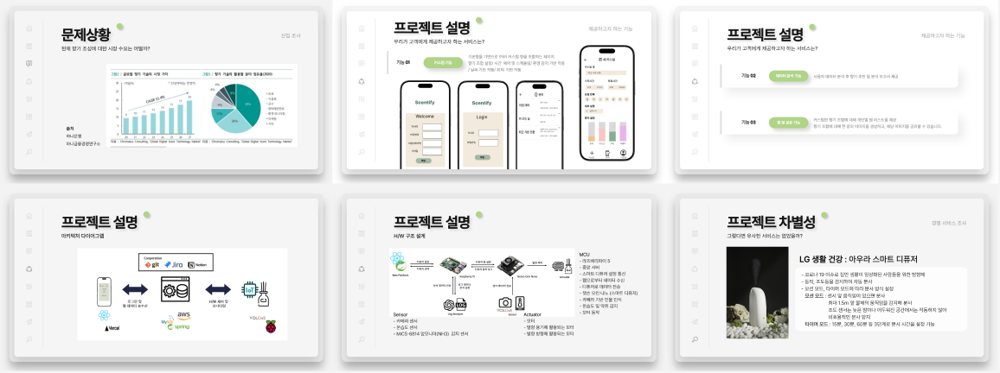
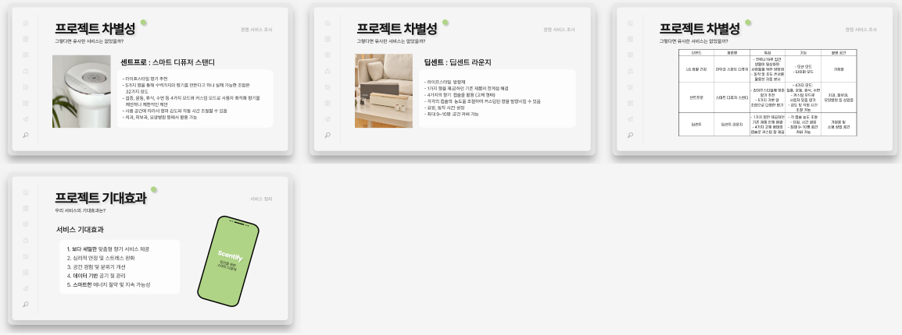

- [1차 기획서](./exec/기획서/1차%20기획서.pdf)
- [2차 기획서](./exec/기획서/2차%20기획서.pptx)

### 2️⃣ 요구사항 분석

### **[기능 명세서]**

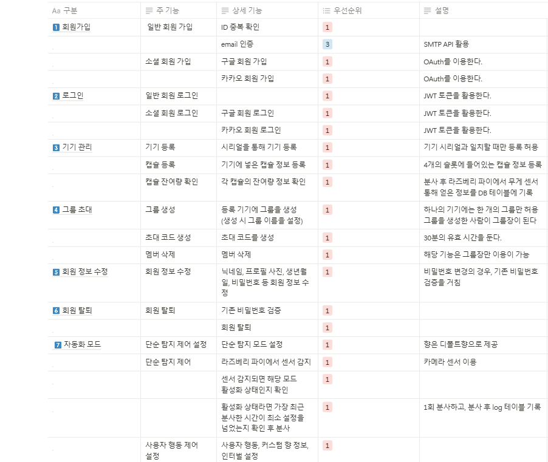
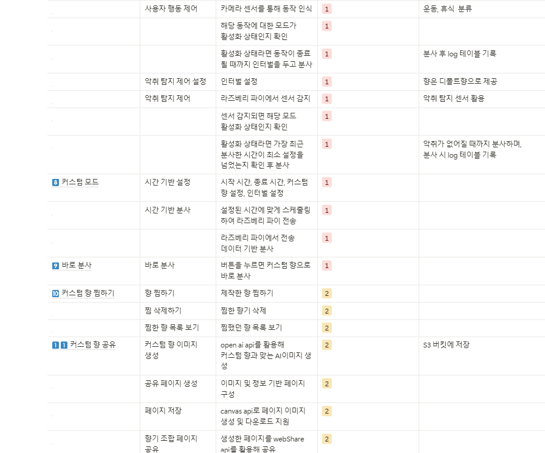

### **[비기능 명세서]**

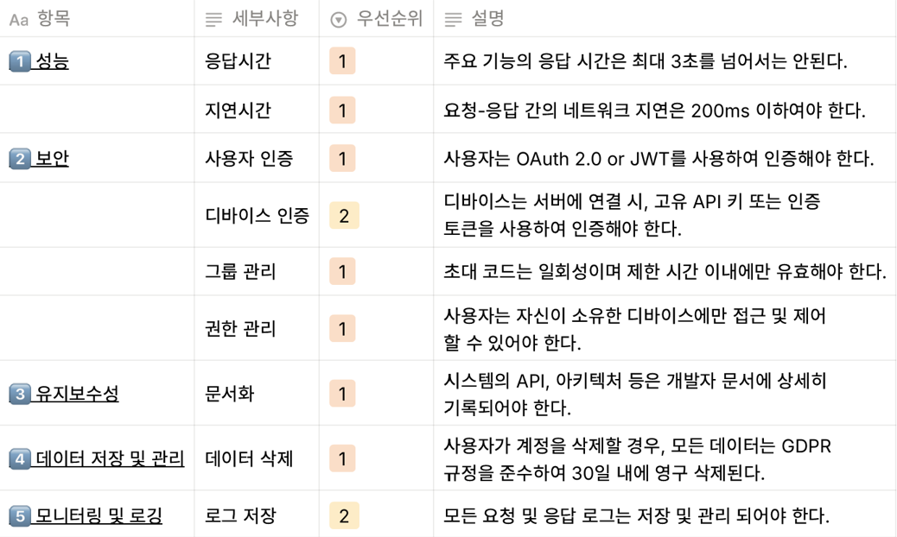

 

## 📌 플로우 차트

 

## 📌 기기 구조

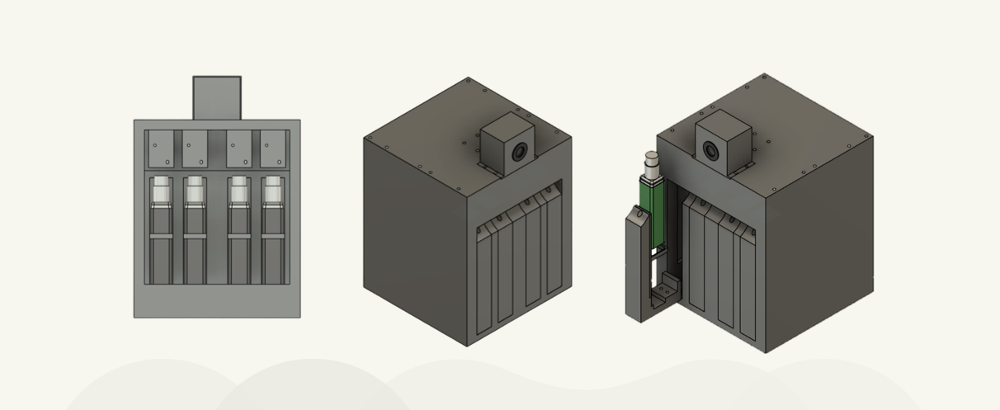

 

## 📌 아키텍처 다이어그램

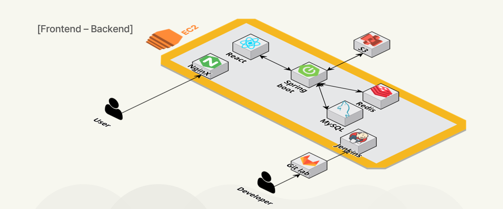
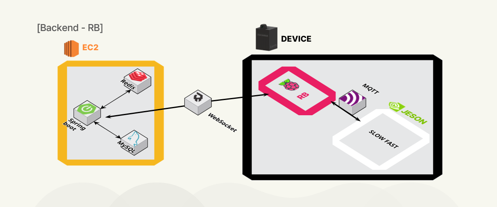
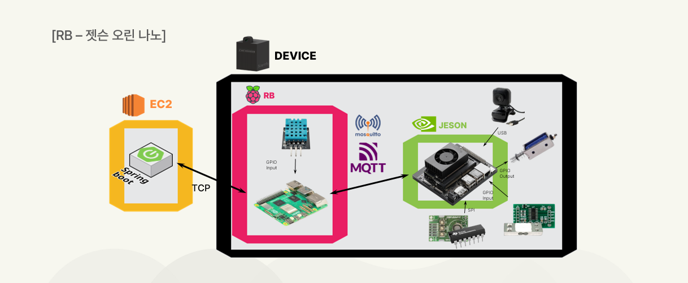

 

## 📌 와이어프레임

 

## 📌 ERD 다이어그램

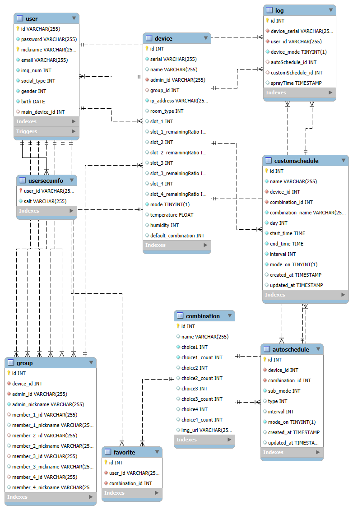

 

## 📌 API 명세서

- [[BE] API 명세서](<./exec/API명세서/API%20명세서(BE).pdf>)
- [[EM] API 명세서](<./exec/API명세서/API%20명세서(EM).pdf>)

## 📌 주요 기능
- 기기 등록

## 📌 유저 테스트

- 삼성 임직원 유저 테스트 참여(2025.02.18)

- 테스트 결과 반영(2025.02.19)

## 📌 배포

- 서비스 URL: http://my-scentify.shop/
- 배포 기간: 2025.02.07 ~ 2025.03.06
- [Scentify 포팅 매뉴얼](./exec/Scentify%20포팅%20매뉴얼.pdf)
